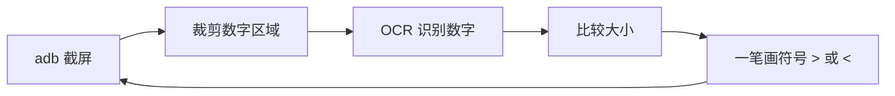

# XiaoYuanKouSuan-Auto（小猿口算自动答题助手）

基于 **ADB + Tesseract OCR** 的安卓端口算 PK 自动答题工具：自动截取手机屏幕 → OCR 识别题目 → 比较大小 → 模拟**一笔手绘**在答题框内写出 `>` / `<`，实现无人值守自动对战。

> 本项目仅供学习 Python / OpenCV / ADB 自动化使用，请勿用于正式比赛或影响他人游戏体验的场合。

## 功能特点

- **真机直连（ADB）**：无需模拟器，手机不卡、坐标稳定
- **双行识别**：一次截图同时识别「当前题」和「下一道灰色预习题」
- **预计算加速**：下一题答案提前算好，题目一更新立即作答，减少每轮 OCR 等待
- **一笔连续手势**：用 `input motionevent` 一笔画完符号，避免被游戏识别成断线
- **三种使用方式**：命令行脚本 / tkinter 图形界面 / PyInstaller 打包 exe
- **自动循环**：持续答题直到没有新题目，自动结束

## 工作原理



核心流程就是「截屏 → 识别 → 比较 → 画符号」四步循环。关键点在于：

1. **识别区域**：小猿口算 PK 界面同时显示两道题，上方是当前题（深色）、下方是下一题（灰色）。脚本用两个区域分别裁剪左右数字。
2. **书写方式**：游戏把手指在答题框内的拖动识别为手写笔画。`adb shell input swipe` 一次只画一段线，两个符号会被识别成两条断开笔画，所以改用 `input motionevent` 在一条命令里完成「按下 → 移动 → 移动 → 抬起」，整个符号一笔连成。

## 环境要求

| 依赖 | 说明 |
|---|---|
| Windows 10/11 + Python 3.9+ | 开发环境 |
| 安卓手机 | 开启开发者选项 + USB 调试 |
| ADB（platform-tools） | 谷歌官方工具，用于截屏和模拟触摸 |
| Tesseract OCR | 文字识别引擎 |
| Python 包 | `opencv-python` `pytesseract` `numpy` |

## 安装

### 1. 安装 ADB

下载 [Google platform-tools](https://dl.google.com/android/repository/platform-tools-latest-windows.zip)，解压到纯英文路径（如 `D:\platform-tools`）。

### 2. 安装 Tesseract

从 [UB-Mannheim/tesseract](https://github.com/UB-Mannheim/tesseract/wiki) 下载安装包，安装时勾选 **English** 语言包（识别数字够用）。

### 3. 安装 Python 依赖

```bash
pip install opencv-python pytesseract numpy
```

### 4. 修改路径常量

打开 [xiaoyuan_auto.py](xiaoyuan_auto.py)，按你的环境修改顶部两个路径：

```python
ADB_PATH = r'D:\platform-tools\adb.exe'                         # adb 实际路径
pytesseract.pytesseract.tesseract_cmd = r'D:\Program Files\Tesseract-OCR\tesseract.exe'  # tesseract 实际路径
```

## 快速开始

### 1. 连接手机

手机开启「开发者选项 → USB 调试」，USB 连电脑，弹窗勾选「始终允许」。验证：

```bash
adb devices
```

输出 `device` 状态（不是 `unauthorized`）即为连接成功。

### 2. 校准坐标（重要，必做）

屏幕坐标与手机分辨率、窗口位置强相关，**不同机型必须重新校准**。用校准脚本：

```bash
python calibrate.py
```

它会截屏并 OCR 输出所有文字的位置（`文字 x=左 y=上 w=宽 h=高`）。拿到题目两个数字的坐标后，填回 [xiaoyuan_auto.py](xiaoyuan_auto.py) 的数字区域常量：

```python
# 当前题（上方那行）左右数字区域 (x1, y1, x2, y2)
TOP_LEFT_BOX  = (203, 770, 460, 870)
TOP_RIGHT_BOX = (797, 770, 1062, 870)
# 下一题（下方灰色那行）左右数字区域
NEXT_LEFT_BOX  = (335, 1050, 515, 1145)
NEXT_RIGHT_BOX = (705, 1050, 935, 1145)
```

**画符号位置校准**：脚本里 `simulate_handwriting` 的坐标是符号的三个转折点。建议先在手机备忘录画板上用 `adb shell input motionevent DOWN/MOVE/UP` 试画，对照调整，再回游戏实测。

### 3. 开始自动答题

手机进入小猿口算 PK 对战界面，运行循环脚本：

```bash
python auto_run_loop.py
```

脚本会自动：截图 → 识别当前题 + 下一题 → 比较 → 画符号，直到连续 15 次识别不到新题目自动结束。按 `Ctrl+C` 可手动停止。

## 使用方式

| 方式 | 文件 | 说明 |
|---|---|---|
| 循环自动答题（推荐） | [auto_run_loop.py](auto_run_loop.py) | 双行识别 + 预计算，自动循环到没题 |
| 主脚本（交互式） | [xiaoyuan_auto.py](xiaoyuan_auto.py) | 运行后输入模式 `1`（比较大小），按 `=` 退出 |
| 图形界面 | [gui_auto.py](gui_auto.py) | tkinter 界面，开始/停止按钮 + 实时日志 |
| 坐标校准 | [calibrate.py](calibrate.py) | 截屏 + OCR 输出文字位置 |

### 打包成 exe

```bash
pip install pyinstaller
pyinstaller --noconfirm --onedir --console --name XiaoYuanConsole auto_run_loop.py
```

- `--onedir`：目录模式，启动快（`--onefile` 单文件启动慢且易被杀软误报）
- `--console`：显示控制台日志
- 运行 exe 时仍依赖 ADB 和 Tesseract 的原始路径存在

## 优化历程（踩坑记录）

### 1. 模拟器卡顿 → 换真机直连

最初用雷电模拟器 + `pyautogui` 截屏画图，模拟器渲染卡、坐标漂移。改用 **ADB 真机直连**后：截屏用 `adb exec-out screencap`，画图用 `adb shell input`，手机本体跑应用不卡。

### 2. 符号画不出来 / 只见一条线 → 一笔连续手势

最初用两次 `adb shell input swipe` 画一个 `>`（两段线），结果游戏只识别出一笔，另一笔断掉。解决办法是用 `input motionevent` 在**一条 shell 命令**内完成：

```
input motionevent DOWN x1 y1; input motionevent MOVE x2 y2; input motionevent MOVE x3 y3; input motionevent UP x3 y3
```

整个符号一笔连成，游戏才能正确识别。

### 3. 数字识别不准（9 识别成 4 / 丢数字）→ 放大 + 单字模式

原始 OCR 直接对裁剪小图识别，小字号数字经常出错。优化：

- 区域先 **2 倍放大**（`cv2.resize`）
- 轻 **高斯模糊** 去噪
- OCR 用 **单字模式** `--psm 8`（识别失败自动回退 `--psm 7`）
- 字符白名单 `tessedit_char_whitelist=0123456789`

### 4. 答题慢 → 双行识别 + 预计算

原来每轮「截图 + OCR 一次」，题目切换时还要再等一轮识别。优化：一次截图**同时识别当前题和下方灰色预习题**，下一题答案提前算好存入缓存，题目一更新直接落笔，省掉关键路径上的 OCR 等待。

### 5. exe 启动慢 → 目录模式

`--onefile` 单文件每次启动都要解压 72MB 到临时目录。改用 `--onedir` 目录模式后秒开，代价是分发时整个文件夹一起拷贝（或建桌面快捷方式）。

## 常见问题

**Q: `adb devices` 显示 `unauthorized`？**
A: 手机弹窗要勾选「始终允许」点确定；若没弹窗，在开发者选项里「撤销 USB 调试授权」后重插。

**Q: OCR 识别出的数字和题目对不上？**
A: 数字区域裁剪坐标不对，重跑 `calibrate.py` 校准；另外确认手机分辨率没变、没开显示缩放。

**Q: 画的符号游戏不认？**
A: 确认画线在答题框内、大小合适；调 `simulate_handwriting` 的三个坐标，或在备忘录画板先试画。

**Q: 程序一直答同一题？**
A: 题目没更新时脚本会自动跳过；如果游戏停在结算界面，脚本会因连续识别不到新题自动结束。

## 目录结构

```
auto-xiaoyuankousuan/
├── xiaoyuan_auto.py      # 核心：截屏 / OCR / 比较 / 一笔画符号
├── auto_run_loop.py      # 循环自动答题（双行识别 + 预计算）
├── gui_auto.py           # tkinter 图形界面
├── calibrate.py          # 坐标校准工具
└── README.md
```

## 免责声明

本项目仅用于技术学习（Python 自动化、OpenCV 图像处理、ADB 命令），请勿用于任何正式比赛、考试或影响他人体验的场景。使用本项目产生的一切后果由使用者自行承担。

## 开源许可

[MIT](LICENSE)
